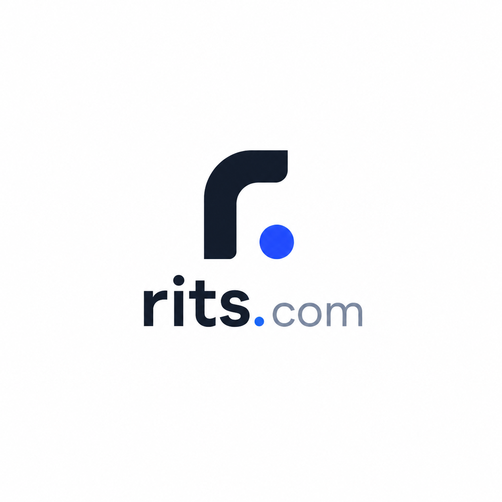
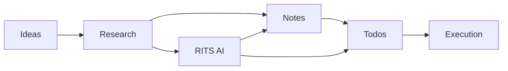
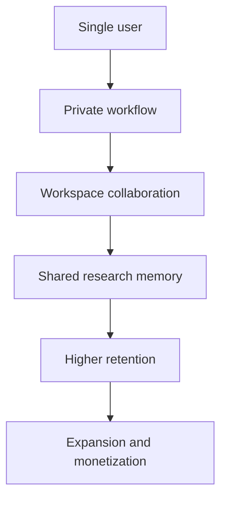

# RITS



**RITS** is a startup research workspace.

It helps founders, operators, consultants, and teams turn scattered thinking into:

- **clear research**
- **actionable decisions**
- **shared execution**

## What RITS Does

- **Capture ideas fast**
- **Turn research into notes and tasks**
- **Use AI on top of your real context**
- **Collaborate in private or workspace mode**
- **Track signals, competitors, roadmaps, newsletters, and feed discussions**

## For Non-Technical Teams

### Why it matters

- **Less chaos**: research, notes, todos, and AI stay in one place.
- **Faster decisions**: teams move from raw input to structured output faster.
- **Better handoff**: founders, analysts, and clients see the same source of truth.
- **Higher trust**: recommendations stay connected to evidence.

### Growth benefits

- **Reduce time lost in scattered tools**
- **Increase execution speed after research**
- **Improve team alignment**
- **Make AI actually useful because it reads your workspace context**



## For Investors

### Simple value proposition

- **RITS is a workflow system, not just a note app**
- **It sits between research and execution**
- **It creates sticky team behavior around context, decisions, and AI usage**

### Why that matters commercially

- **High repeat usage**: teams return daily for notes, tasks, and chat
- **Natural seat expansion**: private work grows into shared workspace usage
- **AI monetization path**: better context creates stronger AI outcomes
- **Data network inside each workspace**: notes, tasks, and research compound over time



## Core Product Areas

- **Ideas**: capture and refine concepts
- **Todos**: private and workspace kanban
- **Notes / Confluence**: rich documents with AI assistance
- **Resources**: save links and references
- **RITS AI**: context-aware assistance
- **Roadmaps**: visual planning with React Flow
- **Competitor Analysis**: market map exploration
- **Newsletter Hub**: read subscribed newsletters without cluttering personal inbox
- **Tech Feed**: startup and tech discussion layer

## Product Model

RITS supports two working modes:

- **Private**: personal thinking, drafts, and early exploration
- **Workspace**: team collaboration, shared research, and execution

```text
Private work -> structured notes -> shared workspace -> tasks -> outcomes
```

## Technical Stack

- **Next.js 16**
- **React 19**
- **TypeScript**
- **Convex** backend and database
- **Clerk** authentication
- **Tailwind CSS v4**
- **TipTap** rich text editing
- **dnd-kit** kanban interactions
- **@xyflow/react** for roadmap builder
- **Zustand** client state

## For Technical Contributors

### Why contribute

- **Real product surface**: not a toy starter app
- **Clear UX problems**: research, AI, collaboration, and workflow systems
- **Modern stack**: Next.js, React 19, Convex, Clerk, Tailwind v4
- **High-impact areas**: editor UX, AI context, roadmap builder, feed, research tools, mobile responsiveness

### Good contribution areas

- **AI workflow improvements**
- **Research tools and analysis UX**
- **Roadmap builder and graph UX**
- **Mobile responsiveness and layout polish**
- **Feed, social, and discussion systems**
- **Workspace permissions and collaboration flows**
- **Convex schema and data modeling**

### App structure

```text
app/                    routes and layouts
components/             product UI
convex/                 backend functions and schema
store/                  client state
public/                 assets and branding
```

### Local setup

```bash
npm install
npm run dev
```

Open `http://localhost:3000`.

### Build

```bash
npm run build
```

## Contribution Notes

- Keep changes **minimal and product-focused**
- Follow the design language in `DESIGN.md`
- Prefer **small, correct UI changes** over extra abstraction
- Respect the app split between **private** and **workspace** behavior
- When touching Convex code, read project guidance in `convex/_generated/ai/guidelines.md`

## Current Direction

RITS is evolving into a startup operating layer where:

- **research becomes structured**
- **AI becomes contextual**
- **team work becomes traceable**
- **ideas turn into execution faster**

If you want to contribute, focus on places where product clarity, speed, and trust improve together.
